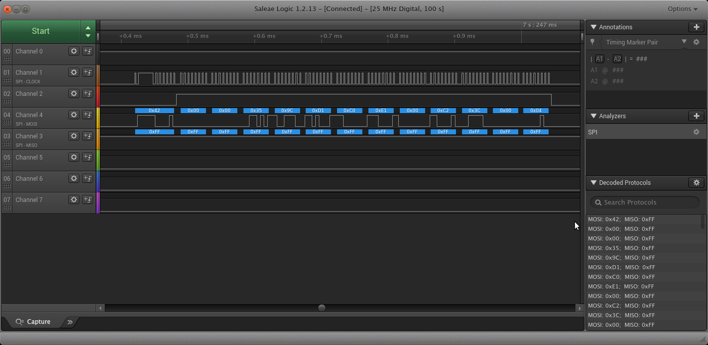
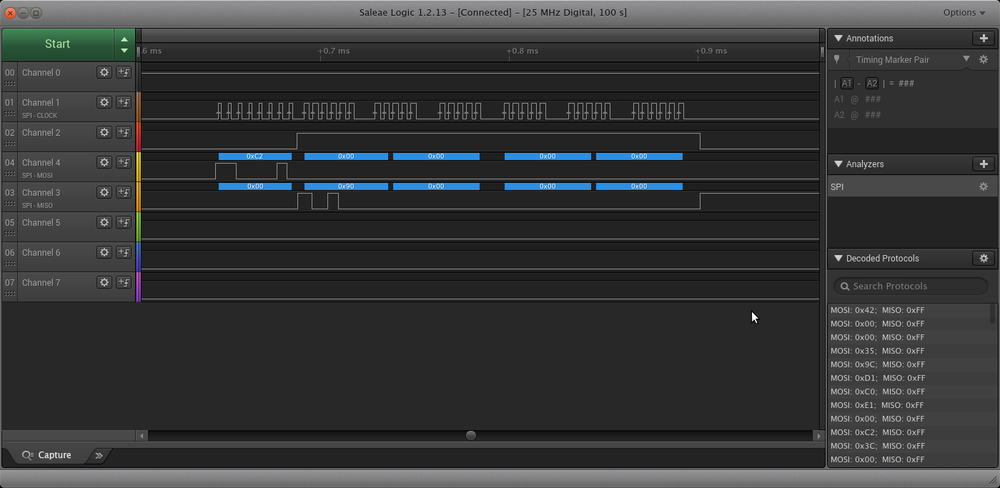

# Honda Radio Code Finder
## Overview
This is an Arduino sketch which interfaces with a Honda radio where normally the LCD face plate would plug in. It mimics pressing the buttons on the screen to enter the code and brute force guesses all the codes until it finds the correct one. It has only been used for 03-07 Honda Accords, and among those only certain radio models (7BK0). As far as hardware I have only tested it on an Arduino Mega2560. 

The motivation was to be able to test radios before reselling them, and to test them I needed the radio code. While you can just [contact Honda](https://radio-navicode.honda.com) for this, I didn't want to be repeatedly requesting codes. Since I've created this I've found out that there are [other websites](https://hondaradiocodes.com/) that will just tell you the code from the serial number, so this project doesn't have much practical use.  

When entering codes, the radio will lock you out for an hour after 10 incorrect attempts. With a 5 digit code and 6 possibilities per digit this leads to a potential 6^5 / 10 hours (or around 32 days) to wait. You could turn the power off for about a minute to erase the volatile memory which lowers the time to 12 hours, but this causes the CD changer mechanism to cycle through all the slots to see if there are any CDs installed and I thought this would prematurely wear out the mechanism. 
## Hardware Control Interface 
On the radios I've looked at there are 2 single row blade pin connectors. I wasn't able to figure out what mating connector would work and didn't want to desolder the mating connector to the front panel, so I made jumper wires using these [Molex pins.](https://www.molex.com/molex/products/part-detail/crimp_terminals/1053002200) I used those since i needed something small to fit between the 1.27(ish) mm blade connectors.
### Interface Pinout
The interface between a Honda radio and the face plate is basically a SPI interface with some notable differences.
The serial connections are labeled on the silkscreen as well as the ground and power button, all of which are needed for the sketch. Format is connector#.pin# on the radio side where pin 1 is marked on the silkscreen but atleast on 7BK0. Pin 1 connector 1 is the left most pin when staring at the connectors with the radio label side up.  

|Signal  |LCD-DI  |LCD-DO  |LCD-CK  |LCD-CE  |PWD-SW |GND  
|---     |---     |---     |---     |---     |---    |---   
|Arduino |51      |50      |52      |21      |22     |GND        
|7BK0    |1.2     |1.14    |1.18    |1.16    |2.7    |1.10 (one of several)

## Usage
Power the arduino, then power the radio. If the serial monitor is connected the status is displayed showing current code.
```
next code: 54254
next code: 54255
next code: 54256
found code
```
Also the onboard LED blinks a heartbeat as the code is being worked on, once the code is found the LED blinks the sequence.

## Protocol
While the SPI peripheral on the Arduino can be used, there are 2 main differences that require some extra logic.
### CE Signal 
The CE signal which normally encompases an entire block of data is used to separate the command type from the data. In the screenshot below, the first byte from the radio is 0x42 which indicates that the following data will be directed to the LCD. 


### MISO Signal
As well as being the input to the radio serial interface, the MISO signal also acts as a flag to let the radio know that a button is pushed down. Normally the input is high, but the display can request a read command be sent by lowering its data line and wait for a 0xC2 command byte. If 0xC2 is seen then the display then sends its button status on its data line. The screenshot below shows a 0xC2 command being sent.

